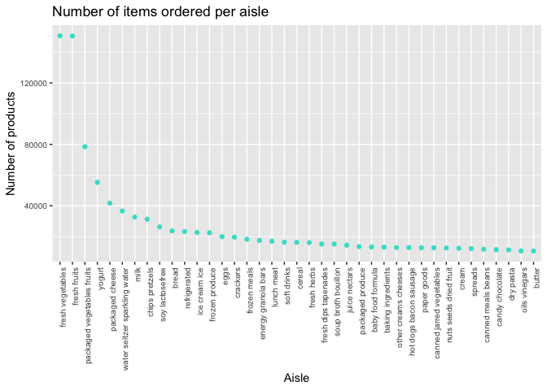

p8105\_hw3\_mk4022
================
Mary Knoop
10/10/2019

``` r
library(tidyverse)
```

    ## ── Attaching packages ───────────────────────────────────────────────────────────────────── tidyverse 1.2.1 ──

    ## ✔ ggplot2 3.2.1     ✔ purrr   0.3.2
    ## ✔ tibble  2.1.3     ✔ dplyr   0.8.3
    ## ✔ tidyr   1.0.0     ✔ stringr 1.4.0
    ## ✔ readr   1.3.1     ✔ forcats 0.4.0

    ## ── Conflicts ──────────────────────────────────────────────────────────────────────── tidyverse_conflicts() ──
    ## ✖ dplyr::filter() masks stats::filter()
    ## ✖ dplyr::lag()    masks stats::lag()

``` r
library(p8105.datasets)
```

Problem 1 Part 1 The goal is to do some exploration of this dataset. To
that end, write a short description of the dataset, noting the size and
structure of the data, describing some key variables, and giving
illstrative examples of observations.

``` r
data ("instacart")
instacart
```

    ## # A tibble: 1,384,617 x 15
    ##    order_id product_id add_to_cart_ord… reordered user_id eval_set
    ##       <int>      <int>            <int>     <int>   <int> <chr>   
    ##  1        1      49302                1         1  112108 train   
    ##  2        1      11109                2         1  112108 train   
    ##  3        1      10246                3         0  112108 train   
    ##  4        1      49683                4         0  112108 train   
    ##  5        1      43633                5         1  112108 train   
    ##  6        1      13176                6         0  112108 train   
    ##  7        1      47209                7         0  112108 train   
    ##  8        1      22035                8         1  112108 train   
    ##  9       36      39612                1         0   79431 train   
    ## 10       36      19660                2         1   79431 train   
    ## # … with 1,384,607 more rows, and 9 more variables: order_number <int>,
    ## #   order_dow <int>, order_hour_of_day <int>,
    ## #   days_since_prior_order <int>, product_name <chr>, aisle_id <int>,
    ## #   department_id <int>, aisle <chr>, department <chr>

The dataset `Instacart` has 1384617 observtaions and 15 variables. Key
variables include order details and product details. The mean hour of
day where orders were made is 13.5775922. The median number of days
between orders is 15.

Part 2 How many aisles are there, and which aisles are the most items
ordered from?

There are 134 aisles. Aisle 83, 24, 123 and 120 are where the most items
were ordered from.

``` r
instacart_one=instacart %>%
  janitor::clean_names() %>%
  group_by(aisle_id, aisle) %>%
  summarize(n = n()) %>%
  arrange(desc(n))
instacart_one
```

    ## # A tibble: 134 x 3
    ## # Groups:   aisle_id [134]
    ##    aisle_id aisle                              n
    ##       <int> <chr>                          <int>
    ##  1       83 fresh vegetables              150609
    ##  2       24 fresh fruits                  150473
    ##  3      123 packaged vegetables fruits     78493
    ##  4      120 yogurt                         55240
    ##  5       21 packaged cheese                41699
    ##  6      115 water seltzer sparkling water  36617
    ##  7       84 milk                           32644
    ##  8      107 chips pretzels                 31269
    ##  9       91 soy lactosefree                26240
    ## 10      112 bread                          23635
    ## # … with 124 more rows

Part 3 Make a plot that shows the number of items ordered in each aisle,
limiting this to aisles with more than 10000 items ordered. Arrange
aisles sensibly, and organize your plot so others can read it.

``` r
aisle_scatter=
  filter(instacart_one, n> 10000)
  ggplot(aisle_scatter, aes(x = reorder(aisle, -n), y =n)) +
  geom_point(color = "turquoise") +
  theme(
    axis.text.x = element_text(angle = 90, hjust = 1), 
    axis.text = element_text(size = 7.5)) +
  labs(
    title = "Number of items ordered in each aisle",
    x = "Aisle",
    y = "Number of products"
  )
```

<!-- -->

Part 4 Make a table showing the three most popular items in each of the
aisles “baking ingredients”, “dog food care”, and “packaged vegetables
fruits”. Include the number of times each item is ordered in your table.

Part 5 Make a table showing the mean hour of the day at which Pink Lady
Apples and Coffee Ice Cream are ordered on each day of the week; format
this table for human readers (i.e. produce a 2 x 7 table).
